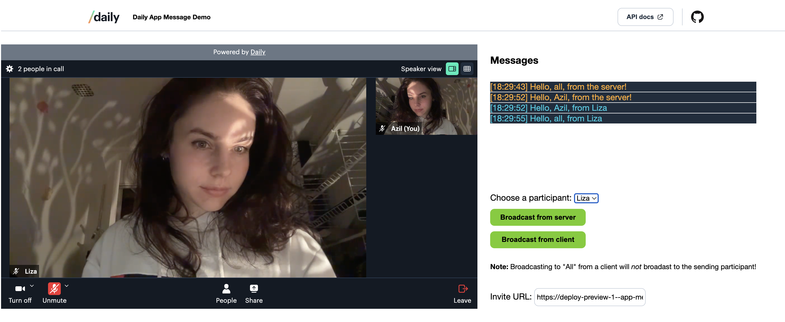

# Daily App Message demo

A demo showing various ways to send data to video call participants with Daily's [`"app-message"` events](LINK).

## Prerequisites

- [Sign up for a free Daily account](https://dashboard.daily.co/signup).

## How the demo works

Describe the demo a little more here.

## Running locally

1. `git clone REPO`
1. Copy `example.env` into a file called `.env``
1. Paste your [Daily API key](LINK) into the `DAILY_API_KEY` variable in the `.env` file. Do _not_ commit this file to source control!
1. `cd app-message`
1. `npm i && npm run dev`

## Contributing and feedback

Let us know how experimenting with this demo goes! Feel free to reach out to us any time at `help@daily.co`.
